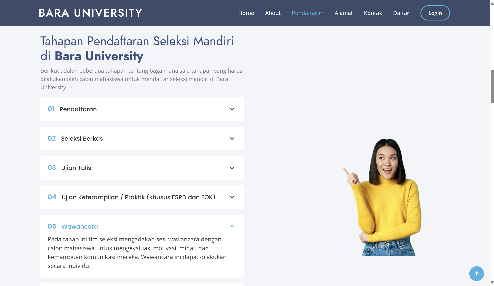
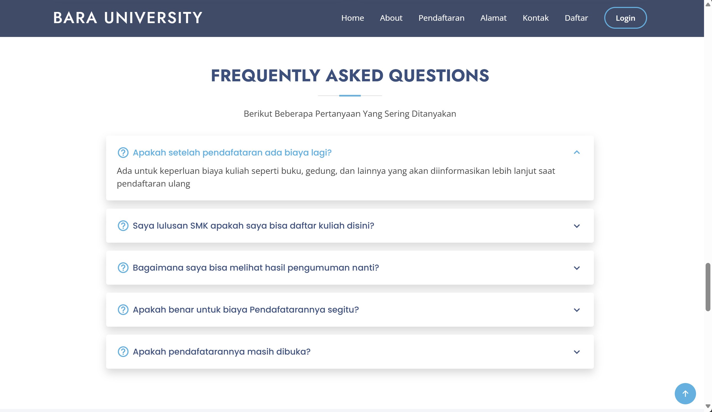
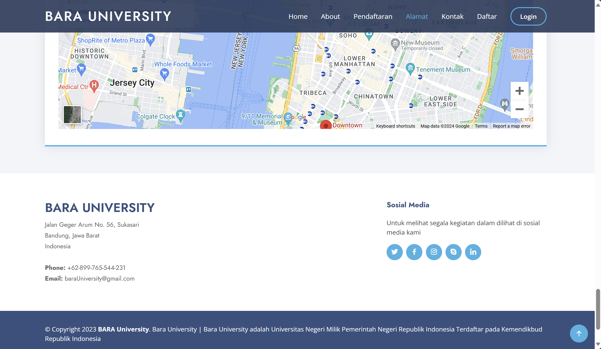
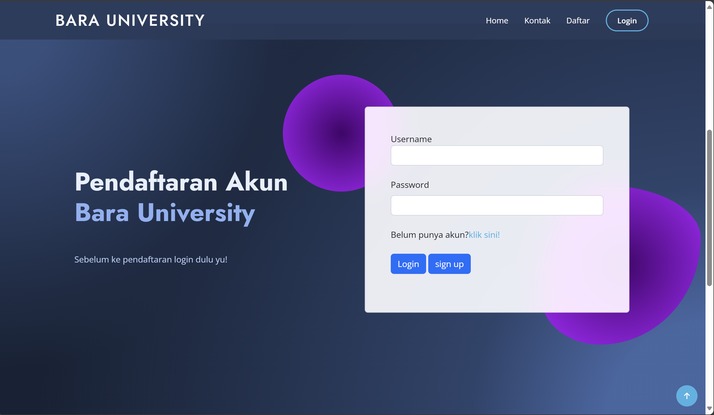
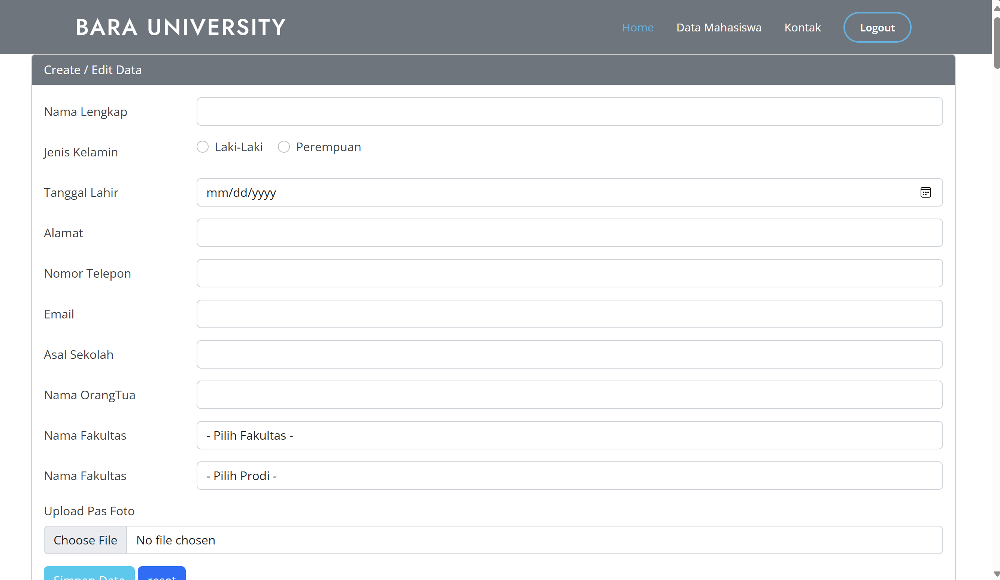
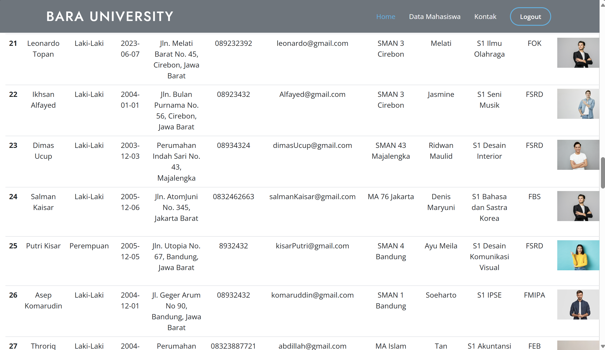

# Bara University
Sebuah aplikasi web untuk melakukan pendaftaran calon mahasiswa ke website bara university agar dapat menjadi mahasiswa


## Daftar Isi
- [Tumpukan Teknologi](#tumpukan-teknologi)
- [Fitur](#fitur)
- [Dokumentasi Halaman](#dokumentasi-halaman)
- [Cara Instalasi](#cara-instalasi)
- [Cara Penggunaan](#cara-penggunaan)

## Tumpukan Teknologi
### Frontend
- **Bootstrap**: Framework CSS yang digunakan untuk membuat desain web yang responsif dan modern dengan cepat

### Bahasa Pemograman
- **PHP**: Bahasa pemrograman skrip yang digunakan untuk pengembangan web server-side

### DBMS
- **MySQL**: Sistem manajemen basis data relasional open-source

## Fitur
- **Login**: masuk ke halaman dengan otentikasi
- **Registrasi**: membuat akun sebelum masuk ke halaman utama
- **Lupa Password**: penggguna dapat mengganti password penggunannya apabila lupa dengan mengirimnya ke email pengguna
- **Remember Me**: pengguna juga dapat mengingat data loginnya apabila setelah login tiba - tiba keluar agar tidak perlu repot mengisi email dan passwordnya selama waktu login belum berakhir
- **Logout**: pengguna dapat keluar dari akun
- **Projekan**: kita dapat menambah, mengubah, menghapus, dan melihat detail dari projekan yang sedang ada
- **Tugas**: pengguna dapat menambah, mengubah, menghapus, dan  melihat list tugas yang sedang dikerjakan oleh masing - masing pengguna / anggota proyekannya
- **Pengguna**: kita juga dapat menambah, mengubah, menghapus, dan  melihat secara detail user yang ada

## Dokumentasi Halaman
##### 1. Halaman Utama

##### 2. Halaman Tahapan Pendaftaran

##### 3. Halaman FAQ

##### 4. Halaman Kaki

##### 5. Halaman Login

##### 6. Halaman Form Admin

##### 7. Halaman Admin


## Cara Instalasi
```bash
# Clone repository ini
git clone https://github.com/defrijay/bara-university.git

# Nyalakan apache dan mysql module di XAMPP

# import file db_bara_university.sql di phpmyadmin

# Pindahkan direktorinya ke htdocs di folder XAMPP

# Buka urlnya local servernya
http://localhost/baraUniversity/

```

## Cara Penggunaan
1. Setelah masuk ke url local servernya, kamu dapat melihat halaman sebelum mendaftar ke halamanya
2. Apabila kamu tertarik mendaftar, maka kamu dapat mendaftar akunnya dan mengisi data form
3. Namun, apabila kamu ada saran terhadap informasi website kamu dapat langsung mengirimnnya langsung tanpa daftar maupun login terlebih dahulu
4. Apabila ingin melihat dashboard admin, maka dapat mendaftarkan akun adminnya
5. Atau kamu juga dapat login menggunakan username `admin` dan password `admin` apabila ingin cepat melihatnya


